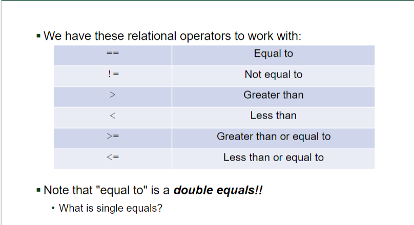
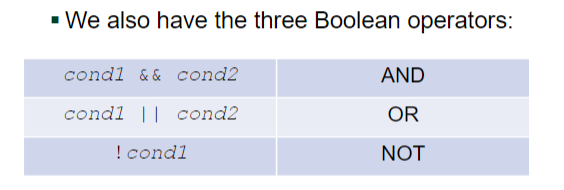
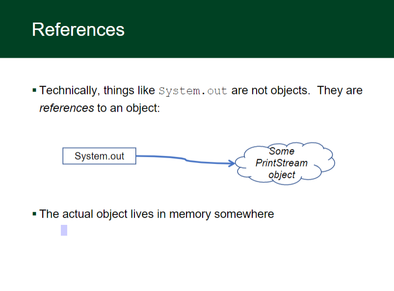
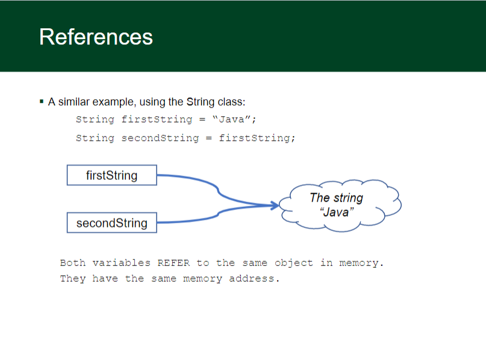

# Conditionals


## Chained/Nested Conditionals

We can string a series of ifs and elses together in three ways:
Chained if/else (exactly one path)

```
f (x > 0) 
 {
    System.out.println("Positive");
} else if (x < 0) 
 { 
    System.out.println("Negative");
} else 
 {
    System.out.println("Zero");
}
```
Nested if/else/if (at most one path):

```
if (place == 1) 
{
System.out.println("Gold medal!");
} else if (place == 2) 
{
System.out.println("Silver medal!");
} else if (place == 3) 
{
System.out.println("Bronze medal.");
}
```

Chained if (any number of paths):

```
if (num % 2 == 0) 
    {
    System.out.println("Divisible by 2");
}
if (num % 3 == 0) 
    {
    System.out.println("Divisible by 3");
}
if (num % 4 == 0) 
    {
    System.out.println("Divisible by 4");
}
```

Nested if (any number of paths):

```
if (x == 0) 
   {
    System.out.println(“on y-axis");
    if (y == 0) 
        {
        System.out.println(“at origin");
    }
}
```



```
public static void hitOrStay(int dealerNum)
    {
        if (dealerNum > 16 && dealerNum <= 21)
        {
            System.out.println("Stay");
        } else if (dealerNum <= 16)
        {
            System.out.println("Hit!");
        } else if (dealerNum > 21)
        {
            System.out.println("Dealer Bust!");
        }
    }
```


## Tokenizing

 - When we use a Scanner, we are doing what is called 
tokenizing input
 - A token is a chunk of input with a distinct meaning or value
 - By default, tokens are separated by whitespace
 - We can change this with the `useDelimiter()` method on 
Scanner
 -  Look it up in the API to learn more

 - As we read tokens, an input cursor moves through the text
 - The next token is read starting from the current cursor position
 - Different methods work different ways 
 - This leads to some interesting behavior...

 - Scanner has some useful methods to help us know what's 
coming:
 - `hasNext()` - is there another token?
 -  `hasNextInt()`, `hasNextDouble()`, ... - is the next token of this 
type?
 - These will help you figure out what type of operation you have 
in your calculator


 - We can also use Scanner to tokenize Strings, instead of 
console input
 - The neat thing is...this works exactly the same way as 
tokenizing input!!
 - The only difference:
 - `Scanner kb = new Scanner(System.in);`
 - becomes

 ```
 String myText = "Hello world"
Scanner tokens = new Scanner(myText);
or even:
Scanner tokens = new Scanner(“Hello world”);
 ```
 
 
 -  When getting user input from the console, read the entire line 
in to one string first

`String input = sc.nextLine();`

Now create a second scanner to read data from the input 
variable

```
Scanner sc2 = new Scanner(input)
If (sc2.hasNextInt()){
int num = sc2.nextInt();
}  // or whatever you’re trying to read in
```


## Objects

 - Recall that only some Java types are primitive types
 - int, char, boolean, etc.
 - Most types in Java are object types
 - An object is an entity that encapsulates related data and 
behavior
 - More on this when we start defining our own objects!


## References



## Reference Analogies
 - You want a friend to see a cool YouTube video of your cat with 
a pancake on its head
 - If you put the whole video in the email, it would bounce back 
(attachment too big)
 - So you send a link (a reference) instead
 - Java does this with objects sent to methods (they tend to be 
big), but not with primitives (which are small)
 - With primitives, we make a copy of the value of the variable, 
and send the copy.

#### Comparing Strings

```
...
String input = "Hello";
String input2 = "Hello";
String input3 = "Hel";
input3 += "lo";
if (input == input2) 
{
    System.out.println("1 & 2 match due to optimizations");
}
if (input != input3) 
{
    System.out.println("1 & 3 don't match because they are at different memory locations");
}
```
Technically this works, because Java optimizes to store literals like "Hello" once (in something called the Heap)
 - But we're comparing the references/memory addresses, not the data, and this won't work with objects from other 
classes, or from classes that we create ourselves
 - So we always use the `.equals()` method to be safe and consistent


 - For objects, the == compares the reference, not the underlying 
object or value
 -  Fortunately, there's another way to compare objects
 - Every object in Java has a method called equals() that does 
a more interesting comparison
 - The details are up to the individual type

 - For Strings, the `.equals` method compares the values instead 
of the references
```
...
if (input.equals("Hello")) 
{
    System.out.println("Hello to you, too!");
}
```
 - This will work the way you hope
 - But what if you type "hello" instead?
 -  Check out `equalsIgnoreCase()` in String
 - Remember, use `object1.equals(object2)` for 
comparing any kind of objects (not just Strings)

## Random numbers
A useful object to generate random numbers

```
Random rand = new Random();
int a = rand.nextInt(6)+1;
int b = rand.nextInt(6)+1;
- must import java.util.*;
```

## Cumulative Algorithms
 - General Format:
```
int sum = 0;
for(some loop definition){
// get the next value
sum += next value
}
// we can use if to make this better
```

## Min/Max

Used in games for bounding boxes around 3d objects
 - General format:
 ```
 int max = something;   // the “something” matters
for(all numbers to examine){
// get the next value
if (next > max){
max = next;
}
}
// initial value “something” should be set to
// the first or lowest possible value
// ex: setting to 0 wouldn’t work if the numbers 
are < 0
 ```
 
 
   
