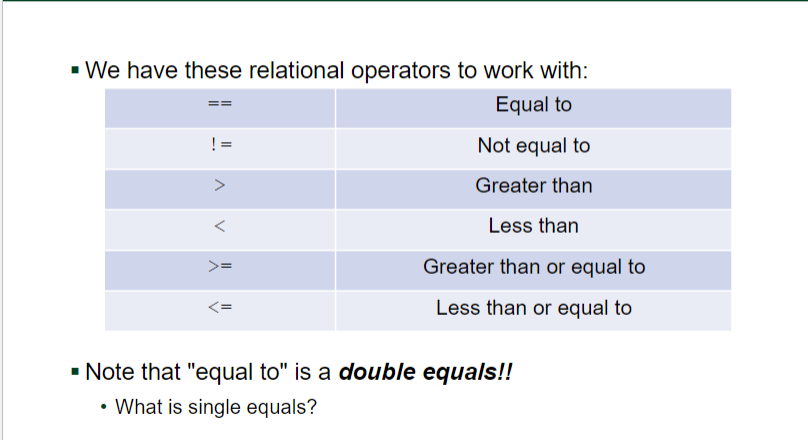
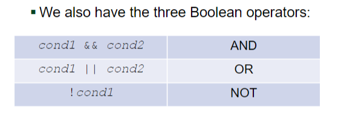
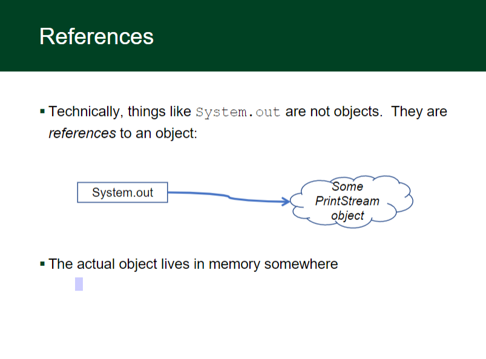
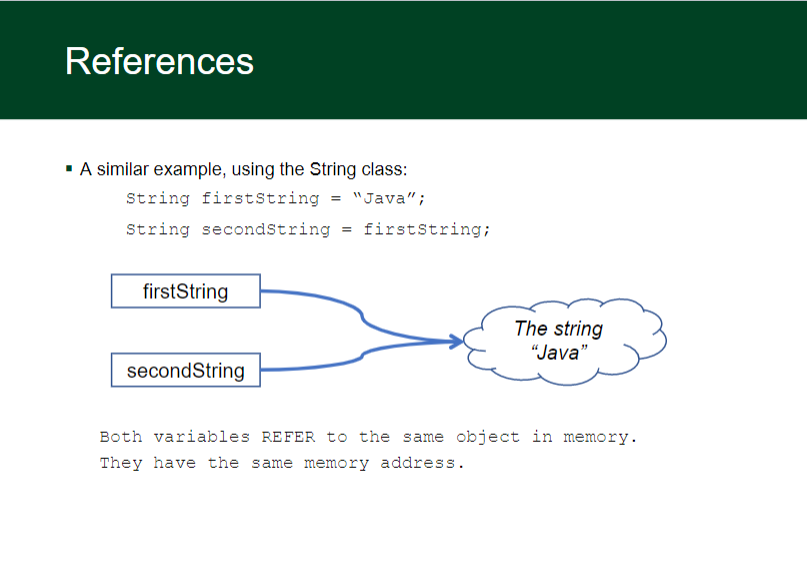

# Conditionals


## Chained/Nested Conditionals

We can string a series of ifs and elses together in three ways:
Chained if/else (exactly one path)

```
f (x > 0) 
 {
    System.out.println("Positive");
} else if (x < 0) 
 { 
    System.out.println("Negative");
} else 
 {
    System.out.println("Zero");
}
```
Nested if/else/if (at most one path):

```
if (place == 1) 
{
System.out.println("Gold medal!");
} else if (place == 2) 
{
System.out.println("Silver medal!");
} else if (place == 3) 
{
System.out.println("Bronze medal.");
}
```

Chained if (any number of paths):

```
if (num % 2 == 0) 
    {
    System.out.println("Divisible by 2");
}
if (num % 3 == 0) 
    {
    System.out.println("Divisible by 3");
}
if (num % 4 == 0) 
    {
    System.out.println("Divisible by 4");
}
```

Nested if (any number of paths):

```
if (x == 0) 
   {
    System.out.println(“on y-axis");
    if (y == 0) 
        {
        System.out.println(“at origin");
    }
}
```



```
public static void hitOrStay(int dealerNum)
    {
        if (dealerNum > 16 && dealerNum <= 21)
        {
            System.out.println("Stay");
        } else if (dealerNum <= 16)
        {
            System.out.println("Hit!");
        } else if (dealerNum > 21)
        {
            System.out.println("Dealer Bust!");
        }
    }
```


## Tokenizing

 - When we use a Scanner, we are doing what is called 
tokenizing input
 - A token is a chunk of input with a distinct meaning or value
 - By default, tokens are separated by whitespace
 - We can change this with the `useDelimiter()` method on 
Scanner
 -  Look it up in the API to learn more

 - As we read tokens, an input cursor moves through the text
 - The next token is read starting from the current cursor position
 - Different methods work different ways 
 - This leads to some interesting behavior...

 - Scanner has some useful methods to help us know what's 
coming:
 - `hasNext()` - is there another token?
 -  `hasNextInt()`, `hasNextDouble()`, ... - is the next token of this 
type?
 - These will help you figure out what type of operation you have 
in your calculator


 - We can also use Scanner to tokenize Strings, instead of 
console input
 - The neat thing is...this works exactly the same way as 
tokenizing input!!
 - The only difference:
 - `Scanner kb = new Scanner(System.in);`
 - becomes

 ```
 String myText = "Hello world"
Scanner tokens = new Scanner(myText);
or even:
Scanner tokens = new Scanner(“Hello world”);
 ```
 
 
 -  When getting user input from the console, read the entire line 
in to one string first

`String input = sc.nextLine();`

Now create a second scanner to read data from the input 
variable

```
Scanner sc2 = new Scanner(input)
If (sc2.hasNextInt()){
int num = sc2.nextInt();
}  // or whatever you’re trying to read in
```


## Objects

 - Recall that only some Java types are primitive types
 - int, char, boolean, etc.
 - Most types in Java are object types
 - An object is an entity that encapsulates related data and 
behavior
 - More on this when we start defining our own objects!


## References



## Reference Analogies
 - You want a friend to see a cool YouTube video of your cat with 
a pancake on its head
 - If you put the whole video in the email, it would bounce back 
(attachment too big)
 - So you send a link (a reference) instead
 - Java does this with objects sent to methods (they tend to be 
big), but not with primitives (which are small)
 - With primitives, we make a copy of the value of the variable, 
and send the copy.

#### Building for source

For production release:

```sh
gulp build --prod
```

Generating pre-built zip archives for distribution:

```sh
gulp build dist --prod
```

## Docker

Dillinger is very easy to install and deploy in a Docker container.

By default, the Docker will expose port 8080, so change this within the
Dockerfile if necessary. When ready, simply use the Dockerfile to
build the image.

```sh
cd dillinger
docker build -t <youruser>/dillinger:${package.json.version} .
```

This will create the dillinger image and pull in the necessary dependencies.
Be sure to swap out `${package.json.version}` with the actual
version of Dillinger.

Once done, run the Docker image and map the port to whatever you wish on
your host. In this example, we simply map port 8000 of the host to
port 8080 of the Docker (or whatever port was exposed in the Dockerfile):

```sh
docker run -d -p 8000:8080 --restart=always --cap-add=SYS_ADMIN --name=dillinger <youruser>/dillinger:${package.json.version}
```

> Note: `--capt-add=SYS-ADMIN` is required for PDF rendering.

Verify the deployment by navigating to your server address in
your preferred browser.

```sh
127.0.0.1:8000
```

## License

MIT

**Free Software, Hell Yeah!**

[//]: # (These are reference links used in the body of this note and get stripped out when the markdown processor does its job. There is no need to format nicely because it shouldn't be seen. Thanks SO - http://stackoverflow.com/questions/4823468/store-comments-in-markdown-syntax)

   [dill]: <https://github.com/joemccann/dillinger>
   [git-repo-url]: <https://github.com/joemccann/dillinger.git>
   [john gruber]: <http://daringfireball.net>
   [df1]: <http://daringfireball.net/projects/markdown/>
   [markdown-it]: <https://github.com/markdown-it/markdown-it>
   [Ace Editor]: <http://ace.ajax.org>
   [node.js]: <http://nodejs.org>
   [Twitter Bootstrap]: <http://twitter.github.com/bootstrap/>
   [jQuery]: <http://jquery.com>
   [@tjholowaychuk]: <http://twitter.com/tjholowaychuk>
   [express]: <http://expressjs.com>
   [AngularJS]: <http://angularjs.org>
   [Gulp]: <http://gulpjs.com>

   [PlDb]: <https://github.com/joemccann/dillinger/tree/master/plugins/dropbox/README.md>
   [PlGh]: <https://github.com/joemccann/dillinger/tree/master/plugins/github/README.md>
   [PlGd]: <https://github.com/joemccann/dillinger/tree/master/plugins/googledrive/README.md>
   [PlOd]: <https://github.com/joemccann/dillinger/tree/master/plugins/onedrive/README.md>
   [PlMe]: <https://github.com/joemccann/dillinger/tree/master/plugins/medium/README.md>
   [PlGa]: <https://github.com/RahulHP/dillinger/blob/master/plugins/googleanalytics/README.md>
